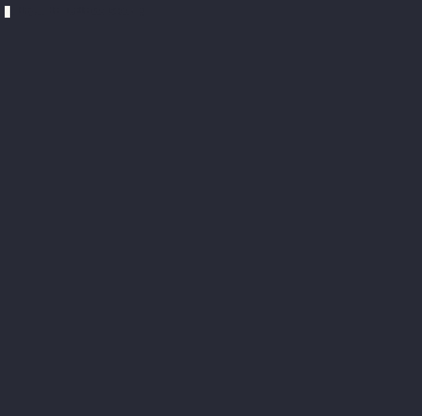

# ◉ ARIA
### Autonomous Reasoning and Intelligent Agent

> Your project-aware coding partner. Reason before action.

ARIA is an open-source CLI agent that works inside your project boundaries like a senior engineer — it plans before acting, validates its work, remembers context across sessions, and never silently modifies your system.

---

**Website:** https://lonerider007.github.io/aria-landing/



## Benchmark — ARIA vs Aider

Tested on: autonomous production backend build (Node.js + Express + SQLite + JWT + RBAC)

| Capability | ARIA | Aider |
|---|---|---|
| Runtime grounding | Excellent | Weak |
| Autonomous debugging | Excellent | Poor |
| Recovery behavior | Excellent | Poor |
| Runtime validation | Successful | Incomplete |
| Convergence stability | Strong | Fragile |
| Production readiness | Near-complete | Incomplete |

**Verdict:** ARIA completed the full backend autonomously. Aider got stuck in edit-format desynchronization loops before reaching runtime execution.

> *Tested on nemotron-3-super:cloud. Both agents given identical task from scratch.*

---

## Install

```bash
pip install aria-x
```

```bash
aria --model nemotron-3-super:cloud
```

Requirements: Python 3.10+, [Ollama](https://ollama.com)

---

## Demo

```
◉ aria(my-project) › Build a REST API with FastAPI and test it

─────────────────── Plan ───────────────────
  Goal: Build FastAPI REST API

  1. Scaffold project with venv + git
  2. Write endpoints
  3. Install dependencies in .venv
  4. Run server and test with curl

Proceed? (yes / no / modify): yes

  ◉ Scaffolding 'fastapi-api'...  step 1
  1. new_project  'fastapi-api'

  ◉ Writing main.py...  step 2
  2. write_file  'main.py'

  ◉ Installing fastapi uvicorn...  step 3
  3. run_command  '.venv/bin/pip install -r requirements.txt'
     │ Successfully installed fastapi uvicorn

  ◉ Running tests...  step 4
  4. run_command  'curl http://localhost:8000/health'
     │ {"status":"ok"}

─────────────────── Report ─────────────────
API built and tested. Run: uvicorn main:app --reload
```

---

## What's New in v1.4.3

- **`aria web`** — access ARIA from any browser on your local network, including phone
- **WebSocket streaming** — real-time token streaming in browser, same as terminal
- **Plan approval in browser** — approve/reject plans via buttons, no terminal needed
- **Mobile-first UI** — dark terminal theme, responsive, works on phone screen
- **Session timeline** — live history panel in browser
- **Auto-reconnect** — browser reconnects automatically if connection drops
- **Install:** `pip install aria-x[web]` → `aria web`

## What's New in v1.4.2

- **Personalized greeting** — ARIA shows your last session context on every startup
- **Python 3.14 AST compatibility** — detects removed node types (`ast.Str`, `ast.Bytes`, `ast.Num`, `ast.NameConstant`) before execution
- **Test suite** — 9 unit tests for AST validator, all passing
- **Updated dependencies** — latest floors for openai, rich, prompt_toolkit, ddgs

## What's New in v1.4.1

- **Sandbox mode** — isolated workspace for experiments (`/sandbox`)
- **Web search** — `search_web` tool searches DuckDuckGo in real time
- **8 security & stability bugs fixed** — code audit pass
- **Rate limit & 500 error handling** — clean messages, auto-retry

## What's New in v1.4.0

- **Humanized tool display** — `◉ Writing auth.py...` instead of raw tool names
- **Persistent token counter** — bottom bar shows `↑ 1.2k tokens · 3 turns · 2m 30s`
- **Internet access** — `search_web` tool for real-time information
- **Config system** — first run saves settings, next run is instant
- **`/history`, `/init`, `/tokens`** — new slash commands
- **`--quiet` mode** — hide tool details, show only final report
- **Context auto-trim** — prevents context overflow crashes
- **English-only responses** — consistent regardless of input language
- **Frozen header** — ARIA info stays visible at startup

---

## Features

- **Plan before action** — shows what it will do, waits for your approval
- **AST pre-validation** — catches errors before running code (no hallucination at this layer)
- **RAG with web search** — searches real docs when stuck, not model memory
- **Loop detection** — detects repeated failures, pivots to alternative approach
- **Project isolation** — all packages go in `.venv` only, never touches system Python
- **Project memory** — remembers stack, decisions, and context across sessions
- **Approval system** — asks before dangerous operations
- **Beautiful diffs** — shows exactly what changed in every file
- **Live status bar** — always know what ARIA is doing

---

## Slash Commands

| Command | Description |
|---|---|
| `/help` | Show all commands |
| `/fix` | Fix bugs in current project |
| `/test` | Run tests, fix failures |
| `/explain <file>` | Explain code |
| `/commit` | Smart git commit |
| `/review` | Code review |
| `/status` | Session info |
| `/model <name>` | Switch model |
| `/memory` | Show project memory |
| `/projects` | List all ARIA projects |
| `/exit` | Exit |

---

## Models

```bash
aria --model nemotron-3-super:cloud   # Ollama cloud
aria --model devstral-2:123b          # Coding specialist
aria --model llama3.3                 # Local via Ollama
aria --model qwen2.5-coder:32b        # Local coding model
```

---

## How it works

```
Clarify → Plan → Approve → Execute → Validate → Remember → Report
```

- **AST Validator** catches errors before execution
- **RAG** injects real documentation on errors
- **Loop detector** pivots approach after 3 repeated failures
- **Memory** persists decisions across sessions

---

## Project Memory

```
~/.aria/
├── user_memory.json
└── projects/
    └── my-project/
        ├── meta.json      # Stack, status, path
        ├── memory.json    # Key decisions
        └── progress.md   # Milestone history
```

---

## Built by

**Sumit** — independent developer  
**GitHub:** [Lonerider007](https://github.com/Lonerider007)  
**Email:** samsungsumitv461@gmail.com

---

## License

MIT
